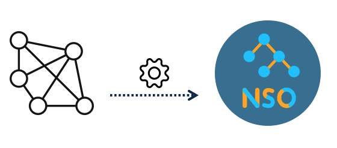
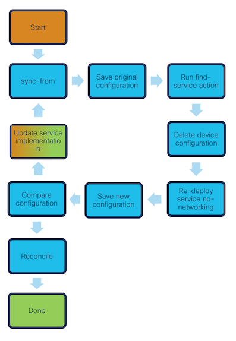

# NSO Service Discovery Tutorial



This repository includes a detailed description and tutorial on discovering 
network services and representing them within NSO.

[TOC]

## Network Service Discovery
Service discovery, in NSO terminology, is the process of finding already
deployed network services and onboard them as NSO services. Whether you are new
to NSO and looking to begin automating your network, or an experienced NSO user
who has not yet integrated all network services, a reliable mechanism and
process for onboarding these services into NSO is essential. This document
outlines a robust approach and methodology for utilizing NSO to accomplish this
and more.

Before delving into details, let's take a step back and consider the definition
of a network service. Some may perceive network services as configurations that
directly relate to higher-level functionalities, such as connectivity,
isolation, or security. The remaining configurations, such as "base config",
are covered by device templates and compliance reports to maintain full control
over your network. Others look at the service concept from a different angle
and argue that any network configuration provides a service by enabling certain
network functionalities. This could include internal configurations, such
as "base config," to facilitate core router connectivity, or a backbone link
necessary for network operations. From this perspective, every network
configuration can be seen as enabling a form of service. Regardless of which
service definition you feel more comfortable with, NSO has the required
functionality to automate your network.

We believe that the advantage of network automation is that it affords network
operators greater control over the network, simplifying management. The
advantage of services in scope of network automation is that they enable
automatic lifecycle management. Additionally, by abstracting complex network
configurations into services, operators gain a clearer understanding of the
network's components. This approach also standardizes services, ensuring
uniform configurations across the network. As a result, the network becomes
more streamlined, and the risk of configuration errors is minimized.

With this in mind, the service discovery reference design process not only aims
to identify all services within your network but also encourages you to
conceptualize most network configurations as services. This perspective can
facilitate the transformation of your network management approach into one
centered around "APIs."

As an analogy, in the realm of software development, the abstraction of
complexities has been a fundamental principle for decades. Many programming
languages, for instance, abstract away low-level byte allocations, making it
easier to focus on creating value rather than on the organization of bits and
bytes in RAM memory. We should strive for a similar approach in networking by
utilizing NSO as a language for network service APIs.

## Assumptions

This tutorial is scoped by the following assumptions:
- The service discovery is run in separate system from the production environment.
- Each service instance touches a single network device.
- All services are implemented with a single device type and version.
- The NED have full support for the service(s) to be discovered.
- Focus is on the service discovery part and will touch but not explain in detail the service onboarding process.

## Services

These services are used in the tutorial.


```
  netinfra/router              netinfra/backbone-link      infra-internal ibgp-fullmesh   l3vpn
        |                              |                                                   |     
        |                              |                                                   |    
        |                              |                                                   |         
   base-config (pc)             ibgp-neighbor (pc)                                        vrf
        |                       backbone-interface                                    vrf-interface
        |                              |                                                   |
        \_______________________________\_________ devices _______________________________/

    (pc) - Precense Container Service, single instance service.
    All other services are list based, allowing multiple instances. 
```

There are more services implemented in this tutorial than are actually used. 
They so also utilize a few additional design concepts that are directly 
related to service discovery. More on those can be found in [Service Design Concepts](README-sections/README-service-design-concepts.md).

## Service Discovery Process
The main challenge in service discovery lies in managing the diverse 
configurations a service can have. If network configurations were 
standardized, discovery would be much simpler. However, this is rarely the 
case. Over time, similar functionalities are often set up in various ways 
across a network.  Using NSO to orchestrate devices is a step towards 
achieving service standardization. Each service is defined and implemented 
through an NSO package, ensuring a uniform configuration. However, previously 
deployed services with the same functionality may differ from the desired 
standardized design. The goal of this process is to address these 
discrepancies by identifying all existing service deployments in their various 
forms. This allows NSO to eventually manage the entire network exclusively 
through NSO services, effectively transitioning from a brownfield to a 
greenfield environment.

It's important to address discrepancies without impacting the network's 
current functionality. Services should be identified in their existing state 
and remain unchanged until the discovery process is complete. Corrections 
should only be made to configurations that do not affect network 
functionality, such as interface descriptions. If this isn't feasible, the 
discrepancies should be managed by incorporating support for them within the 
NSO service packages. This approach ensures that any deviations can be easily 
rectified through the discovered services, aiding in network cleanup. Once the 
discovery is finished and services are refined and standardized, the network 
will follow a consistent service implementation, defined with minimal NSO 
service data.

The process of identifying service deviations can be complex and challenging. 
To effectively address this, it is advantageous to narrow the scope and 
address the issue incrementally. The ultimate objective is to map every 
configuration line across all devices to NSO services; however, this will not 
be the initial focus. Given that NSO has already segmented the network into 
individual devices, it is logical for the discovery process to follow this 
structure. This approach necessitates that NSO services provision each device 
independently, which can be facilitated through a stacked service 
architecture. By doing so, the focus shifts from discovering all services 
across the network to identifying services on a device-by-device basis. This 
methodical approach enables comprehensive discovery of the entire network, one 
device at a time.

To effectively discover services on a device, it is essential to define and 
implement them in an ideal and standardized format, accompanied by service 
discovery code, which can be developed as an action callback. This callback 
will navigate through the NSO device tree, traversing the device configuration 
to map it into service configuration, following a bottom-up approach. This 
method is advantageous over a top-down approach because the device 
configuration reflects the actual running network. While inventories may not 
always match real configurations, the device configurations are a reliable 
source of truth. Therefore, to accurately discover services as they are 
deployed in the network, a bottom-up approach is preferred. The initial 
service design and its corresponding action form the foundation and starting 
point for service discovery. Once defined, the process begins, and all 
services discoverable with the current implementation will be identified. 
After executing the action and discovering services, deviations must be 
identified. That is, deviations between what device configurations the NSO 
services support and how services are configured on the network.

Depending on the nature of these deviations, addressing them may necessitate 
modifications to the NSO packages to accommodate the identified deviations. It 
is advisable not to address all deviations simultaneously, as the list may be 
too extensive to manage effectively. Instead, selecting a smaller subset of 
deviations and resolving them makes the task more manageable. The services are 
then revised to support the selected deviations, reloaded into NSO, and the 
service discovery action is executed again, with the expectation of 
identifying more services than in the previous run. Once again, remaining 
deviations are identified, services are adjusted to support them, and the 
action is executed anew. This iterative process continues until all deviations 
are resolved, ensuring that all services on a device have been discovered and 
accurately mapped into an NSO service.

Executing these iterations within a production environment could significantly 
reduce the process's throughput. Developing, testing, and deploying packages 
into production is a stringent process that cannot be completed in a single 
day, let alone multiple times within a day, as this procedure might require. 
Therefore, it is advisable to conduct this process "offline" by downloading a 
copy of the NSO device tree, loading it into a separate NSO instance deployed 
elsewhere, and conducting the procedure there. The device tree configuration 
will be instrumental in tracking progress by comparing the current discovery 
capabilities against the actual device configuration. Each discovery iteration 
will identify a number of services, representing the current service coverage. 
By comparing the device configurations these services produce against the 
configurations extracted from the brownfield networks, we can determine which 
configuration lines remain uncovered. 

The simplest method to achieve this is by recreating the discovered services 
in another clean NSO instance, capturing the complete device configuration 
once deployed, and comparing it to the device data downloaded from the 
production environment. Any configurations present in the brownfield set but 
absent from the service-produced set are not yet covered by any discovered 
service and should be addressed. Conversely, if configurations are present in 
the service-produced set but absent from the brownfield set, it indicates a 
deviation of NSO services from the current network, which should also be 
rectified, as we aim to avoid modifying the network during the discovery 
process. Such adjustments will be reserved for the cleanup phase once the 
discovery is complete. 

While various comparison methods can be used, this example utilizes XML file 
comparisons. The original brownfield configuration can be extracted from the 
production NSO via the CLI by displaying the device configuration in XML 
format and saving it to a file, referred to as the "brownfield config." Once 
services are discovered, they can be deployed on an NSO with a clean CDB and 
an empty device configuration. Deploying these services will configure the 
device according to the current service coverage. This resultant configuration 
can be saved in a second XML file, similar to the brownfield config. 
Consequently, we obtain a brownfield XML and a service coverage XML.

A simple diff tool can then be used to compare these two XML files. This 
comparison acts as our coverage check. Any configuration missing in the 
service coverage XML indicates aspects currently not discovered or supported 
by the services, while configuration missing in the brownfield XML suggests 
that our services have generated configurations not present in the existing 
network. The latter should be considered a bug in the service implementation 
and must be addressed. It is essential that the discovered services do not 
alter the network in any way.

The ultimate goal is to ensure that all device configurations are 
comprehensively covered by NSO services, without exception. However, 
situations may arise where it becomes necessary to proceed to the next device 
before the current one is fully covered. Nonetheless, it remains essential to 
perform coverage checks for each iteration to maximize discovery potential 
while excluding configurations designated for later resolution. A temporary 
service, used solely for the discovery process, can be utilized for this 
purpose, where all temporarily ignored configurations can be added by this 
service. This service would be created along with the rest of the discovered 
services, thus incorporating that configuration into the service-created 
device configuration set and removing it from the differential. Once all 
service types are supported and the discovery code can accurately identify 
them, the packages can then be deployed into the production environment to 
finalize the service discovery.



| Step | Action |
| ---- | ------ |
| 1 | Update NSO to be in-sync with the network. |
| 2 | Save the original configuration for the device to be scanned for services. |
| 3 | Run find-services action to create NSO service instances. |
| 4 | Delete the device's configuration from NSO (Network is unaffected). |
| 5 | Re-deploy the NSO service instance with no-networking optn to produce the service device configuration using current implementation. |
| 6 | Save the new configuration for the device. |
| 7 | Compare original with new device's configuration to find missing and/or redundant information. |
| 8 | No differentces? All is good and reconcile to let NSO take ownership the service's configuration. |
| 9 | Some differences? Update the service's implementation to minimize differences and re-iterate. |

These steps help ensure that the network services are accurately represented 
in the network management system and that any discrepancies between the 
desired and actual network configurations are identified and resolved.

## Setup

### Dependencies
The tutorial requires the use of the Resource Manager package and the
Juniper-Junos NED. To execute the tutorial successfully, these packages must
be placed within the packages directory.

Versions that the tutorial supports:
resource-manager: 4.2.8
juniper-junos: 4.16.2

### Build and start

````
source <path to ncsrc>
make build start
````

NSO and netsim devices are now up and running, but not loaded with any 
configuration. The tutorial will go through all steps from setting up 
necessary resources to onboarding devices in NSO and all steps for service 
discovery.

### Load devices with configuration

Load the devices with initial configuration for out brouwnfield network 
required for this tutorial. NSO requires
resource pools, for the resource manager. The netsim devices are loaded with
the brownfield config.

- Device CR-1 configuration example: [CR-1.xml](device-configs-brownfield/CR-1.xml)
- Resource manager configuration: [config-resource-pools.xml](nso-config/config-resource-pools.xml)

```
make tutorial-sd-1-start
```

### Onboard devices

Load the devices name and address configuration to NSO, [netsim_init.xml](netsim_init.xml), 
and run devices sync-from.

```
make tutorial-sd-2-onboard-devices
```


### Create nodes

Create /nodes/router services in NSO, these are just a minimal skeleton,
essentially the bare minimum for the node service, so that we in turn get 
a /devices/device{foo} The find-services actions themselves are located under 
/nodes/router so that's why we need the /nodes/router service instances.

```
make tutorial-sd-3-create-nodes
```

You are now ready to proceed with the tutorial.

## Tutorial

Each step is executed through a makefile target.

The details for each target is found in [tutorial.mk](/tutorial.mk) file for details.

The tutorial is devided into a separate parts, divided per device, to guide 
you through the different challenges of service discovery. First the lower 
level RFS services will be discovered, followed by the upper level CFS 
services.

### RFS Services - The bottom layer

First discovery the services for device CR-1 and then proceed with the next 
(click on the name to get the instructions)

| Device | Steps | Description |
| - | - | - |
| [CR-1](README-sections/README-service-discovery-part1.md) | 4-11 | Walk through the service discovery process and learn the details of each step when discovering services in a device without discrepancies.  |
| [CR-2](README-sections/README-service-discovery-part2.md) | 12-13 | Handle a device with a minor configuration spelling error. | 
| [CR-2](README-sections/README-service-discovery-part3.md) | 14-16 | Ignoring configuration diff temporarily. | 
| [CR-3](README-sections/README-service-discovery-part4.md) | 17 | Successful discovery of services. |
| [ER-1](README-sections/README-service-discovery-part5.md) | 18-22 | Detect and add missing MTU configuration in the service implementation. |
| [ER-2](README-sections/README-service-discovery-part6.md) | 23 | Successful discovery of services in the device. |
| [ER-3](README-sections/README-service-discovery-part7.md) | 24 | Successful discovery of services in the device. |

### CFS Services - The upper layer

First discovery the netinfra services and then proceed with the next (click on 
the name to get the instructions)

| Device | Steps | Description |
| - | - | - |
| [netinfra](README-sections/README-service-discovery-part8.md) | 25-26 | Find netinfra services. |
| [l3vpn](README-sections/README-service-discovery-part9.md) | 27-28 | Find l3vpn services. |

### Out of band changes
| Device | Steps | Description |
| - | - | - |
| [ER-3](README-sections/README-service-discovery-part10.md) | 29-34 | Handle out-of-band changes in device ER-3. |
